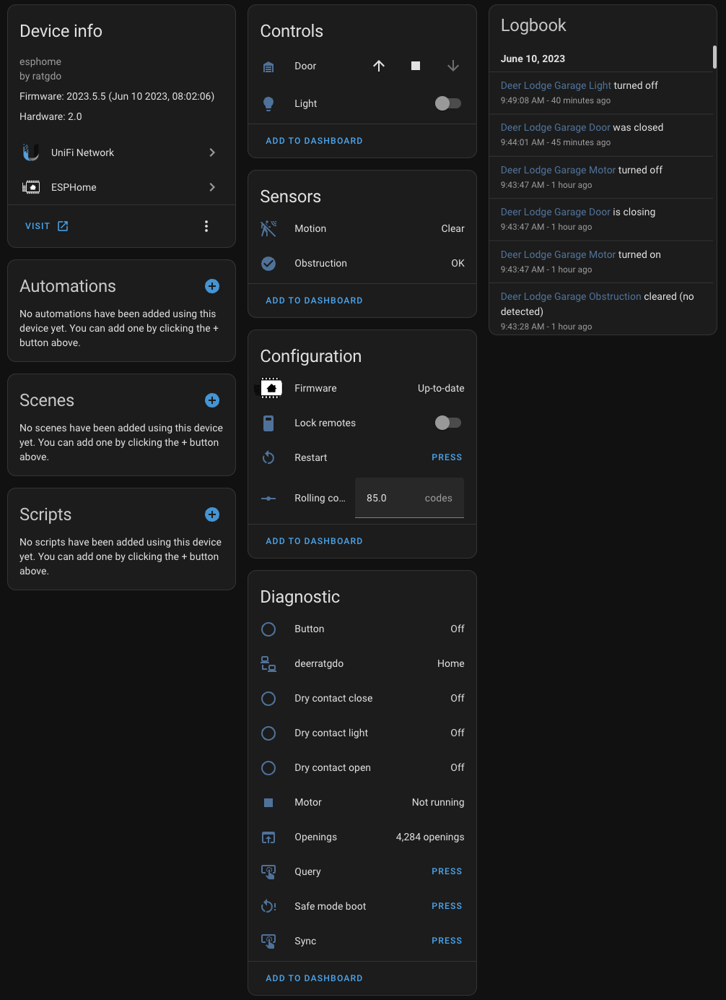

# ratgdo for ESPHome

This is a port of the ratgdo software for the v2.0/v2.5 board to ESPHome.

[Visit the github.io page to purchase boards](https://paulwieland.github.io/ratgdo/#order)

## Installation

- Flash the ESPHome based firmware using the [Web Installer](https://ratgdo.github.io/esphome-ratgdo/)

It is no longer necessary to save the rolling code counter when switching between firmware.

## First use after adding to Home Assistant

The ESPHome firmware will allow you to open the door to any position after calibration. To calibrate the door, open and close it once without stopping.

## ESPHome config

- [Security+ 2.0 for v2.0 board with ESP8266 D1 Mini](https://github.com/RATGDO/esphome-ratgdo/blob/main/static/v2board_esp8266_d1_mini.yaml)
- [Security+ 2.0 for v2.0 board with ESP8266 D1 Mini lite](https://github.com/RATGDO/esphome-ratgdo/blob/main/static/v2board_esp8266_d1_mini_lite.yaml)
- [Security+ 2.0 for v2.0 board with ESP32 D1 Mini](https://github.com/RATGDO/esphome-ratgdo/blob/main/static/v2board_esp32_d1_mini.yaml)
- [Security+ 2.0 for v2.0 board with ESP32 Lolin D2 Mini](https://github.com/RATGDO/esphome-ratgdo/blob/main/static/v2board_esp32_lolin_s2_mini.yaml)
- [Security+ 2.0 for v2.5 board with ESP8266 D1 Mini lite](https://github.com/RATGDO/esphome-ratgdo/blob/main/static/v25board_esp8266_d1_mini_lite.yaml)
- [Security+ 1.0 for v2.5 board with ESP8266 D1 Mini lite](https://github.com/RATGDO/esphome-ratgdo/blob/main/static/v25board_esp8266_d1_mini_lite_secplusv1.yaml)
- [Security+ 2.0 for v2.5 board with ESP32 D1 Mini](https://github.com/RATGDO/esphome-ratgdo/blob/main/static/v25board_esp32_d1_mini.yaml)
- [Security+ 1.0 for v2.5 board with ESP32 D1 Mini](https://github.com/RATGDO/esphome-ratgdo/blob/main/static/v25board_esp32_d1_mini_secplusv1.yaml)
- [Security+ 2.0 for v2.5i board](https://github.com/RATGDO/esphome-ratgdo/blob/main/static/v25iboard.yaml)
- [Security+ 1.0 for v2.5i board](https://github.com/RATGDO/esphome-ratgdo/blob/main/static/v25iboard_secplusv1.yaml)

- [Web Installer](https://ratgdo.github.io/esphome-ratgdo/)

