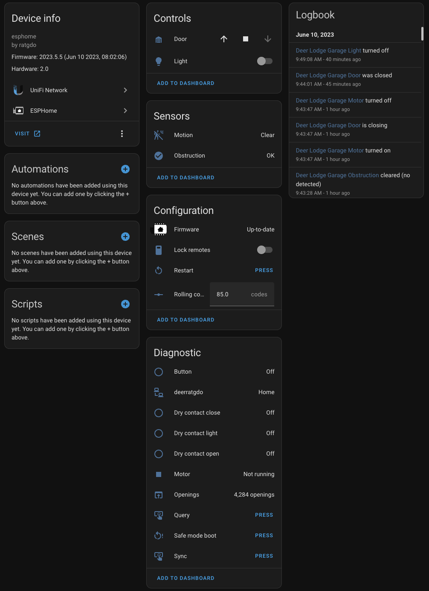

# ratgdo for ESPHome

[Visit the ratcloud.llc to purchase boards](https://ratcloud.llc)

## Web Installer

Flash the ESPHome based firmware using the [Web Installer](https://ratgdo.github.io/esphome-ratgdo/).

## First use after adding to Home Assistant

The ESPHome firmware will allow you to open the door to any position after calibration. To calibrate the door, open and close it once without stopping.


## ESPHome configs

| Board | Chip | Protocol | Config |
|-------|------|----------|--------|
| v2.0 | ESP8266 D1 Mini | Security+ 2.0 | [v2board_esp8266_d1_mini.yaml](static/v2board_esp8266_d1_mini.yaml) |
| v2.0 | ESP8266 D1 Mini lite | Security+ 2.0 | [v2board_esp8266_d1_mini_lite.yaml](static/v2board_esp8266_d1_mini_lite.yaml) |
| v2.0 | ESP32 D1 Mini | Security+ 2.0 | [v2board_esp32_d1_mini.yaml](static/v2board_esp32_d1_mini.yaml) |
| v2.0 | ESP32 Lolin S2 Mini | Security+ 2.0 | [v2board_esp32_lolin_s2_mini.yaml](static/v2board_esp32_lolin_s2_mini.yaml) |
| v2.5 | ESP8266 D1 Mini | Security+ 2.0 | [v25board_esp8266_d1_mini.yaml](static/v25board_esp8266_d1_mini.yaml) |
| v2.5 | ESP8266 D1 Mini | Security+ 1.0 | [v25board_esp8266_d1_mini_secplusv1.yaml](static/v25board_esp8266_d1_mini_secplusv1.yaml) |
| v2.5 | ESP8266 D1 Mini lite | Security+ 2.0 | [v25board_esp8266_d1_mini_lite.yaml](static/v25board_esp8266_d1_mini_lite.yaml) |
| v2.5 | ESP8266 D1 Mini lite | Security+ 1.0 | [v25board_esp8266_d1_mini_lite_secplusv1.yaml](static/v25board_esp8266_d1_mini_lite_secplusv1.yaml) |
| v2.5 | ESP32 D1 Mini | Security+ 2.0 | [v25board_esp32_d1_mini.yaml](static/v25board_esp32_d1_mini.yaml) |
| v2.5 | ESP32 D1 Mini | Security+ 1.0 | [v25board_esp32_d1_mini_secplusv1.yaml](static/v25board_esp32_d1_mini_secplusv1.yaml) |
| v2.5i/2.52i/2.53i | ESP32 | Security+ 2.0 | [v25iboard.yaml](static/v25iboard.yaml) |
| v2.5i/2.52i/2.53i | ESP32 | Security+ 1.0 | [v25iboard_secplusv1.yaml](static/v25iboard_secplusv1.yaml) |
| v2.5i/2.52i/2.53i | ESP32 | Dry Contact | [v25iboard_drycontact.yaml](static/v25iboard_drycontact.yaml) |
| v3.2 | ESP32 | Security+ 2.0 | [v32board.yaml](static/v32board.yaml) |
| v3.2 | ESP32 | Security+ 1.0 | [v32board_secplusv1.yaml](static/v32board_secplusv1.yaml) |
| v3.2 | ESP32 | Dry Contact | [v32board_drycontact.yaml](static/v32board_drycontact.yaml) |
| v3.2 Disco | ESP32 | Security+ 2.0 | [v32disco.yaml](static/v32disco.yaml) |
| v3.2 Disco | ESP32 | Security+ 1.0 | [v32disco_secplusv1.yaml](static/v32disco_secplusv1.yaml) |
| v3.2 Disco | ESP32 | Dry Contact | [v32disco_drycontact.yaml](static/v32disco_drycontact.yaml) |



## Troubleshooting

### False obstruction events on ESP32 v2.5 boards

Some v2.5 boards using ESP32 D1 Mini controllers may report spurious obstruction events. This is caused by the obstruction sensor "asleep" detection logic being inverted on these boards.

To fix this, add the following to your ESPHome config:

```yaml
ratgdo:
  id: ratgdov25
  obst_sleep_low: true
```

The `id` must match the `id` of the existing `ratgdo` component in your config (e.g. `ratgdov25` for v2.5 boards). This setting tells the obstruction sensor to treat LOW as the "asleep" state instead of the ESP32 default of HIGH.
